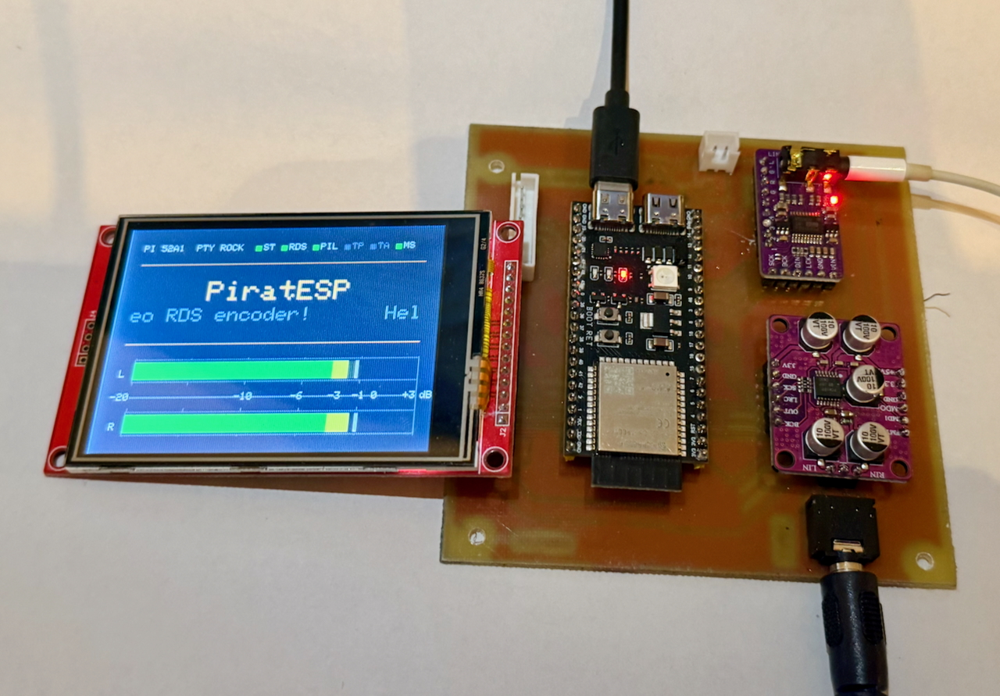

# PiratESP32 - DSP BASED RDS STEREO ENCODER FOR FM RADIO

[](https://deepwiki.com/MarcFinns/PiratESP32-FM-RDS-STEREO-ENCODER)

A complete FM stereo encoder with RDS (Radio Data System) support, implemented entirely in software on the ESP32-S3 **(and now ESP32)** microcontroller. This project processes stereo audio in real-time through a sophisticated 24 bit DSP pipeline to generate broadcast-quality FM multiplex signals.

**This project was the testbed to benchmark AI-assisted software develpment tools (Anthropic Claude Code and OpenAI Codex)** in a complex setup, beyond the usual precooked demos!

**IMPORTANT NOTE:** Some PCM1808 ADC breakout boards from AliExpress have a very aggressive low pass filter (according to the ADC datasheet, the filter is unnecessary and they chose a wrong capacitor value...). This results in a lowpass filter at 6Khz! If sound is muffled, you can just desolder the caps (or break them, it is fine). See explanation and pictures of where these caps are in [ESP32 S3 STEREO DSP](https://github.com/MarcFinns/ESP32-S3-STEREO-DSP)



## Features

- **Real-time FM Stereo Encoding**: Stereo audio → FM multiplex (MPX)
- **RDS Core**: PI/PTY/TP/TA/MS, PS/RT with EU PTY mapping; RT rotation list
- **Runtime Controls (SCPI/JSON)**: Full CLI for RDS, audio, pilot, and system; JSON replies
- **Profiles (NVS)**: Save/load named configurations via serial console
- **Pilot Control**: Enable and auto‑mute on silence (threshold/hold configurable)
- **Configurable Pre‑emphasis**: 50 µs (EU) or 75 µs
- **Sophisticated DSP Pipeline**:
  - Audio sampling at 24 bit
  - Pre‑emphasis filtering (50/75 µs)
  - 19 kHz notch filter to prevent pilot tone interference
  - 4× polyphase FIR upsampling (48 kHz → 192 kHz or 44.1 kHz → 176.4 kHz) with 15KHz LPF
  - Stereo matrix (L+R mono and L-R difference signals)
  - Numerically controlled oscillator (NCO) for phase-coherent 19KHz pilot tone, 38 KHz stereo subcarrier, 57 KHz RDS subcarrier
  - Double sideband suppressed carrier (DSB-SC) modulation of stereo difference signal on digitally synthesised 38 KHz subcarrier
  - RDS BPSK modulation on digitally synthesised 57 KHz subcarrier
  - Digital mixing of L+R mono signal, 19KHz pilot, DSB-SC modulated 38 KHz subcarrier, and BPSK modulated 57 KHz subcarrier
  - MPX audio out via 32 bit DAC at 176.4 kHz or 192 KHz
  
- **Real-time VU Meters**: ST7789 TFT display with stereo level monitoring
- **Dual-Core Architecture**: Four tasks across both cores (DSP/Console/RDS/Display)
- **Performance Monitoring**: Real-time CPU usage and audio statistics logging

## Hardware Requirements

The project works with the following components, or even better with the board described in [ESP32 S3 STEREO DSP](https://github.com/MarcFinns/ESP32-S3-STEREO-DSP)

### ESP32 Board
- ESP32-S3 or classic ESP32 with dual-core processor

### Audio Interfaces
- **ADC**: PCM1808 I2S audio ADC (24 bit, I2S slave)
- **DAC**: PCM5102A I2S audio DAC (16/24/32 bit, I2S slave)
- **Master Clock**: 22.579 MHz or 24.576 MHz MCLK for synchronization (ESP32 is I2S master)

### Display (Optional)
- ST7789 320x240 TFT LCD (SPI interface)
- Used for real-time VU meter visualization and debug messages

## Pin Configuration

**NOTE:** Two separate sections in config.h for ESP32-S3 and classic ESP32


### I2S Audio 
```
Master Clock (shared):  GPIO 8  (22.579 MHz or 24.576 MHz MCLK)

DAC Output:
  BCK  (Bit Clock):     GPIO 9
  LRCK (Word Select):   GPIO 11
  DOUT (Serial Data):   GPIO 10

ADC Input:
  BCK  (Bit Clock):     GPIO 4
  LRCK (Word Select):   GPIO 6
  DIN  (Serial Data):   GPIO 5
```

### ST7789 TFT Display
```
SCK  (SPI Clock):       GPIO 40
MOSI (SPI Data):        GPIO 41
DC   (Data/Command):    GPIO 42
CS   (Chip Select):     GPIO 1
RST  (Reset):           GPIO 2
```

## Additional Documentation

- Software_Architecture.md — Tasks, cores, queues, modules, pattern
- SerialConsole.md — SCPI/JSON serial CLI (source of truth)

## Software Architecture

### Task Distribution

**Core 0 (Real-Time Audio):**
- `DSP_pipeline` task (priority 6 - highest)
- Handles all audio I/O and DSP processing
- Must maintain strict timing for glitch-free audio

**Core 1 (Non-Real-Time):**
- `Console` task (priority 2) - Serial owner (CLI) + log draining
- `VU Meter` task (priority 1) - Display rendering
- `RDS Assembler` task (priority 1) - RDS bitstream generation

### Signal Flow

```
1. I2S RX (stereo ADC input)
        ↓
2. Pre-emphasis filter (50 or 75 µs FM standard)
        ↓
3. 19 kHz notch filter
        ↓
4. 4× polyphase FIR upsampling
        ↓
5. Stereo matrix (L+R and L-R signals)
        ↓
6. NCO carrier generation (19 kHz pilot, 38 kHz subcarrier, 57 kHz RDS)
        ↓
7. MPX synthesis (mono + pilot + stereo + RDS)
        ↓
8. I2S TX (DAC output - the DAC is stereo, the same MPX signal is on both outputs)
```

## Installation

### Prerequisites
- [Arduino IDE](https://www.arduino.cc/en/software) 2.x or later
- [ESP32 Arduino Core](https://github.com/espressif/arduino-esp32)

### Libraries Required
- Arduino GFX Library (https://github.com/moononournation/Arduino_GFX)


### Compilation

1. Clone or download this repository
2. Open `PiratESP32-FM-RDS-STEREO-ENCODER.ino` in Arduino IDE
3. Select your ESP32 board:
   - `Tools → Board → ESP32 Arduino → [Your Board]`
4. Configure settings:
   - CPU Frequency: 240 MHz
   - Flash Size: 4 MB or larger
   - Partition Scheme: Default or Minimal SPIFFS
5. Click Upload

## Configuration

All configuration parameters are centralized in `Config.h`:

### Key Parameters

```cpp
// Sample rates
SAMPLE_RATE_ADC = 48000 or 44100   // Input sample rate (Hz)
SAMPLE_RATE_DAC = 192000 or 176400 // Output sample rate (Hz)

// Audio processing
BLOCK_SIZE = 64           // Samples per block (1.33 ms latency)
PREEMPHASIS_TIME_CONSTANT_US = 50.0f  // 50 µs (EU) or 75 µs (USA)
ENABLE_PREEMPHASIS = true  // Enable/disable pre-emphasis stage (for testing)

// Multiplex levels
PILOT_AMP = 0.09f         // Pilot tone amplitude (~9%)
DIFF_AMP  = 0.90f         // Stereo difference amplitude
RDS_AMP   = 0.04f         // RDS injection level (~4%)

// MPX component toggles (for measurements/testing)
ENABLE_AUDIO                   = true // Program audio (L+R and L-R) into MPX
ENABLE_STEREO_PILOT_19K        = true // 19 kHz pilot tone
ENABLE_RDS_57K                 = true // 57 kHz RDS subcarrier
ENABLE_STEREO_SUBCARRIER_38K   = true // 38 kHz stereo subcarrier (L−R DSB)
TEST_OUTPUT_CARRIERS           = false // If true: Left=19 kHz pilot, Right=38 kHz subcarrier

// Diagnostics (see Config.h for performance logging cadence)

// Display settings
VU_DISPLAY_ENABLED = true // Enable/disable TFT display
VU_USE_PEAK_FOR_BAR = true // Peak (true) or RMS (false) mode
```

### Task Pinning (Config-controlled)

Task-to-core assignment is configured exclusively in `Config.h` and applied at runtime by the SystemContext and each module’s startTask:

```
// Config.h core selections (0 or 1)
CONSOLE_CORE   // Console task core
VU_CORE        // VU display task core
RDS_CORE       // RDS assembler task core
DSP_CORE       // DSP pipeline task core

// Related priorities and stacks are also defined in Config.h
CONSOLE_PRIORITY, VU_PRIORITY, RDS_PRIORITY, DSP_PRIORITY
CONSOLE_STACK_WORDS, VU_STACK_WORDS, RDS_STACK_WORDS, DSP_STACK_WORDS
```

At startup, each module logs its actual core, for example:
- "Console running on Core X" (Serial)
- "VUMeter running on Core X"
- "RDSAssembler running on Core X"
- "DSP_pipeline running on Core X"

Use these messages and the status panel CPU metrics to verify your pinning after editing `Config.h`.

### GPIO Pin Customization

Edit pin assignments in `Config.h` to match your hardware.

## Usage

### Basic Operation

1. Connect I2S ADC and DAC to the configured GPIO pins
2. Connect ST7789 TFT display (if using VU meters)
3. Power on the ESP32
4. Audio processing starts automatically
5. Monitor Serial output (115200 baud) for diagnostics

### RDS Configuration

Use the serial console (Console task) with SCPI-style commands (115200 baud):

Quick start
- `SYST:LOG:LEVEL OFF`          # silence periodic logs while configuring
- `RDS:PI 0x52A1`
- `RDS:PTY POP_MUSIC`           # or a number 0–31
- `RDS:PS "NJOYLIFE"`
- `RDS:RT "Artist - Title"`
- `AUDIO:STEREO 1`              # enable L−R (38 kHz)
- `PILOT:ENABLE 1`              # enable pilot (19 kHz)
- `RDS:ENABLE 1`                # enable RDS (57 kHz)

See `docs/SerialConsole.md` for the full command reference.

### Performance Monitoring

Serial console output (every 5 seconds):
```
[timestamp] DSP_pipeline: 48000 Hz, CPU 22.5%, Headroom 77.5%
[timestamp] Peak: L=-12.3 dBFS, R=-14.1 dBFS
```

## Project Structure
See `docs/Project_Structure.md` for a complete overview of files and folders.

## RDS Groups Implemented
- Group 0A: PI, flags, PS
- Group 2A: RT (A/B toggle on change)
- Group 4A: CT clock-time from NTP when WiFi is available

## Performance

**Typical Processing Metrics:**
- Block processing time: ~300 µs
- Available time per block: 1,333 µs (@ 48 kHz, 64 samples)
- CPU usage: ~52%
- Headroom: ~48%
- Latency: 1.33 ms (negligible for audio applications)

**Memory Usage:**
- DSP_pipeline stack: 12 KB
- DSP buffers: ~9 KB
- Console stack: 4 KB
- VU Meter stack: 4 KB

## Technical Details

### FM Stereo Multiplex Spectrum
```
0-15 kHz:    Mono (L+R) - main audio channel
19 kHz:      Pilot tone (9% modulation) - stereo indicator
23-53 kHz:   Stereo subcarrier (L-R, DSB-SC modulated on 38 kHz)
57 kHz:      RDS data (1187.5 bps, BPSK modulation)
```

### DSP Specifications
- **Pre-emphasis**: 1st-order IIR high-pass, 50 µs time constant
- **Notch filter**: 2nd-order IIR, 19 kHz center, Q=0.98
- **Upsampler**: 96-tap polyphase FIR (15 kHz LPF), 4× interpolation
- **NCO**: Phase-accumulator synthesis, coherent harmonics

### Real-Time Constraints
- Block size: 64 samples @ 48 kHz = 1.33 ms available time
- Target CPU: <30% (leaves 70% headroom for jitter tolerance)
- All processing must complete within 1.33 ms to avoid audio glitches

## Troubleshooting

**No audio output:**
- Check I2S pin connections
- Verify MCLK is running at 24.576 MHz
- Check Serial console for I2S initialization errors

**Audio glitches/dropouts:**
- Reduce CPU load by disabling diagnostics (`DIAGNOSTIC_PRINT_INTERVAL = 0`)
- Check Serial console for CPU usage >80%
- Disable TFT display if not needed (`VU_DISPLAY_ENABLED = false`)

**Display not working:**
- Verify ST7789 pin connections
- Check SPI interface is not shared with other devices
- Try toggling `TFT_ROTATION` setting (0-3)

**RDS not transmitting:**
- Verify `ENABLE_RDS_57K = true` in Config.h
- Check RDS amplitude (`RDS_AMP`) - typical range 0.02-0.04
- Monitor Serial console for RDS Assembler task errors

## License

This project is provided as-is for educational and non-commercial use. Refer to individual library licenses for third-party components.

## Credits

Developed for ESP32 platform using:
- ESP32 Arduino Core by Espressif Systems
- Adafruit GFX Library
- FreeRTOS (integrated in ESP32 SDK)

## Contributing

Contributions are welcome! Areas for improvement:
- Support for 75 µs pre-emphasis (North American standard)
- Additional RDS features (AF, CT, EON)
- Web interface for RDS configuration
- Automatic gain control (AGC)
- Stereo width control

## References

- [FM Broadcasting Standards](https://en.wikipedia.org/wiki/FM_broadcasting)
- [RDS/RBDS Protocol](https://en.wikipedia.org/wiki/Radio_Data_System)
- [ESP32 I2S Documentation](https://docs.espressif.com/projects/esp-idf/en/latest/esp32/api-reference/peripherals/i2s.html)
